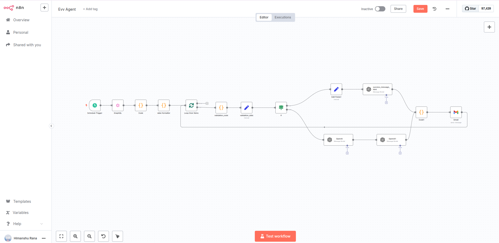

# EVV Agent

Automatically validates system data and sends email notifications about validation errors or success status.

## Components

• Schedule Trigger - Automated workflow execution
• GraphQL - Data retrieval from CareBravo API
• Code - JSON parsing and data formatting
• Split in Batches - Loop processing for multiple records
• Python Validation - Custom validation logic for healthcare data
• OpenAI - AI-powered message formatting
• Gmail - Email notification delivery
• Conditional Logic - Success/error path routing

## Tools

• CareBravo Healthcare System API
• OpenAI GPT-4O-Mini
• Gmail OAuth2 Integration
• Python Code Execution
• GraphQL Query Engine

## Examples

• Daily validation of client medicaid IDs, addresses, and program enrollments
• Automated error reporting for invalid ZIP codes, missing SSNs, or incorrect state codes
• Success notifications when all client data passes validation checks
• Batch processing of multiple healthcare agencies with individual email reports

## Technical Details

The workflow fetches healthcare data via GraphQL, validates client information against XML records using Python logic, formats results with AI-generated templates, and delivers HTML email notifications. Data flows through conditional branching to handle both success and error scenarios, with loop processing for handling multiple client records per agency.