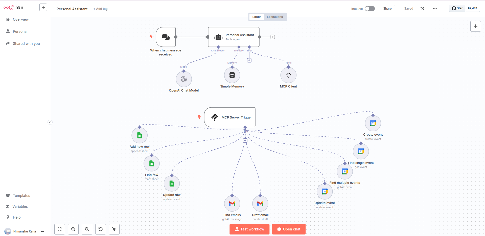

# Mcp based Personal Assistant AI Workflow

An AI-powered personal assistant that manages emails, calendar events, and contacts through natural language conversations.

## Components

* Chat Trigger - Receives user messages
* Personal Assistant Agent - AI coordinator with OpenAI GPT-4o
* Simple Memory - Maintains conversation context
* MCP Server & Client - Manages tool connections
* Google Calendar Tools - Event management
* Gmail Tools - Email operations
* Google Sheets Tools - Contact management

## Tools

* Create calendar events
* Update calendar events
* Find single calendar event
* Find multiple calendar events
* Draft emails
* Find emails
* Add new spreadsheet rows
* Find spreadsheet rows
* Update spreadsheet rows

## Examples

* "Schedule a meeting with John tomorrow at 2 PM"
* "Draft an email to the marketing team about next week's campaign"
* "Add Sarah's contact information to my contacts sheet"
* "Find all emails from clients this week"

## Technical Details

The workflow processes chat messages through an AI agent that determines which tools to use based on user requests. The MCP (Model Context Protocol) server coordinates between the AI agent and various Google services, while memory maintains conversation continuity across interactions.