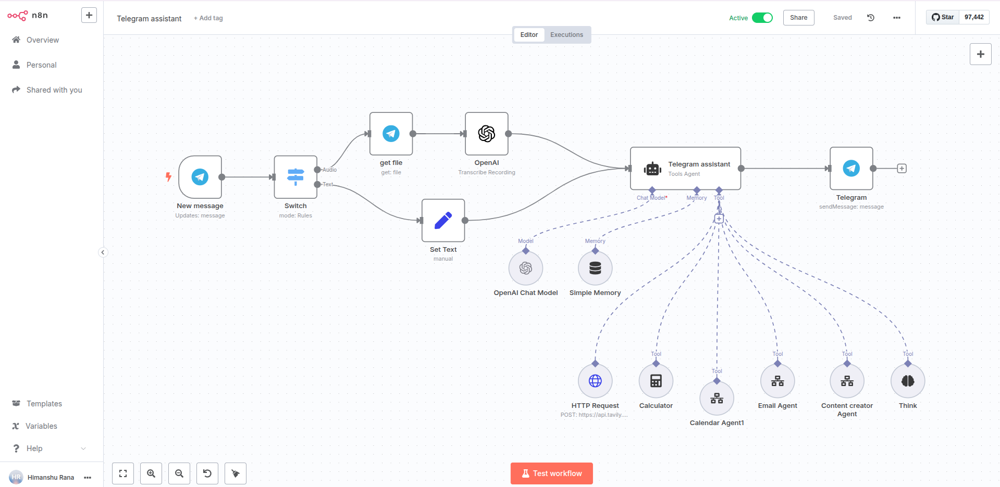
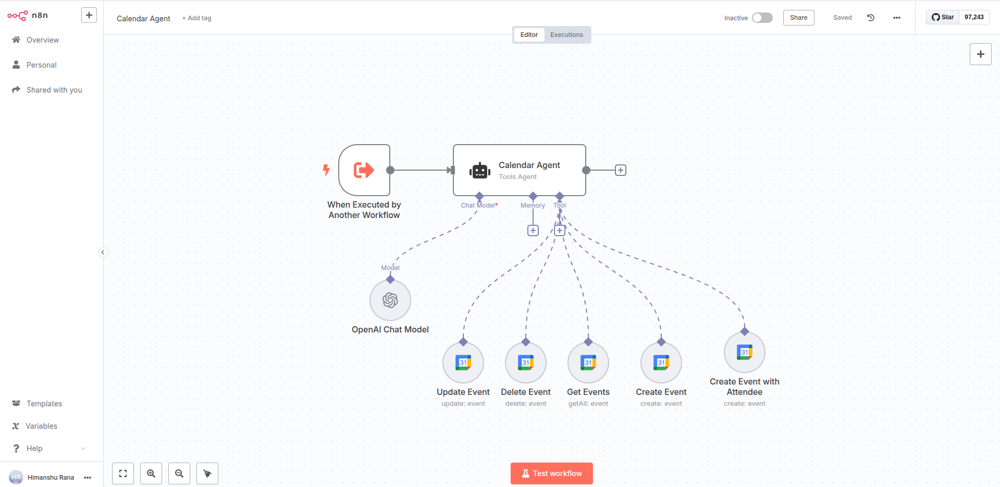
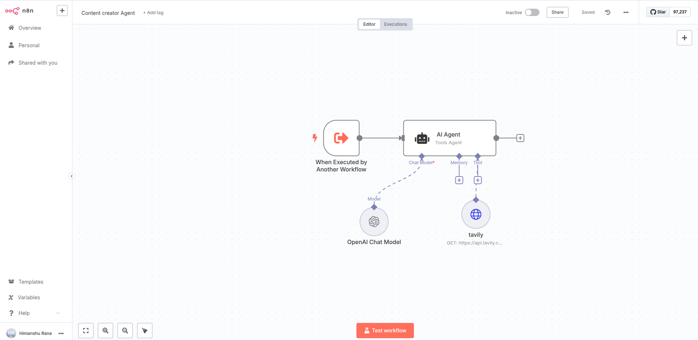
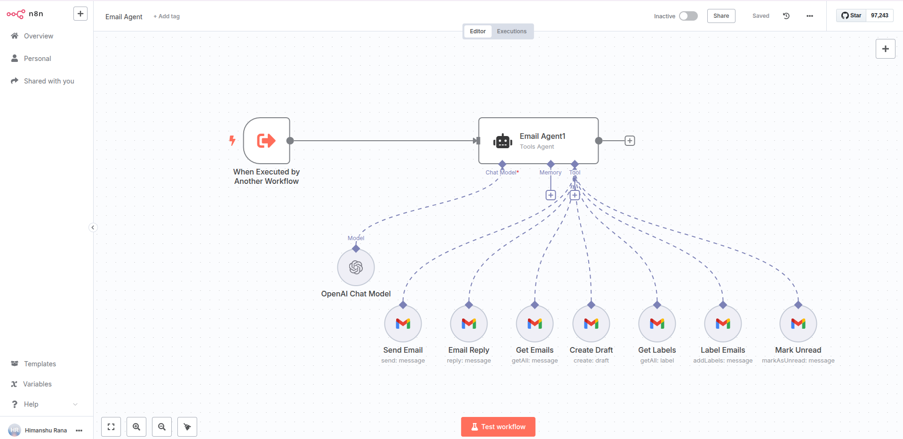

# Telegram AI Assistant Workflow

An intelligent Telegram bot that processes text and voice messages through specialized AI agents for email, calendar, content creation, and web search tasks.

## Components

* Telegram Trigger - Receives incoming messages
* Switch Node - Routes between text and voice messages
* File Retrieval - Downloads voice message files
* OpenAI Transcription - Converts voice to text
* Set Text Node - Formats text messages
* Telegram Assistant Agent - Main AI coordinator with GPT-4o
* Simple Memory - Maintains chat history per user
* Telegram Response - Sends replies back to users

## Sub-Agents

* Email Agent - Handles email composition, sending, and management
* Calendar Agent - Manages calendar events and scheduling
* Content Creator Agent - Generates blog posts and written content
* Contact Agent - Manages contact information and lookups

## Tools

* Think Tool - Internal reasoning and planning
* Calculator - Mathematical computations
* Tavily Web Search - Real-time web search and news
* Email workflow integration
* Calendar workflow integration
* Content creation workflow integration

## Examples

* "Send an email to John asking about the meeting time"
* "Schedule a call with the marketing team for tomorrow at 3 PM"
* "Write a blog post about AI automation trends"
* "Search for the latest news about cryptocurrency"

## Technical Details

Messages from Telegram are processed through a switch that handles both text and voice inputs. Voice messages are transcribed using OpenAI's Whisper model. The main assistant agent determines which specialized sub-agent to invoke based on the user's request, with memory maintaining conversation context per chat ID. Responses are sent back through the Telegram API.

### Telegram Assistant - Main Agent

### Calendar Agent - SubAgent

### Content Creator Agent

### Email Agent
