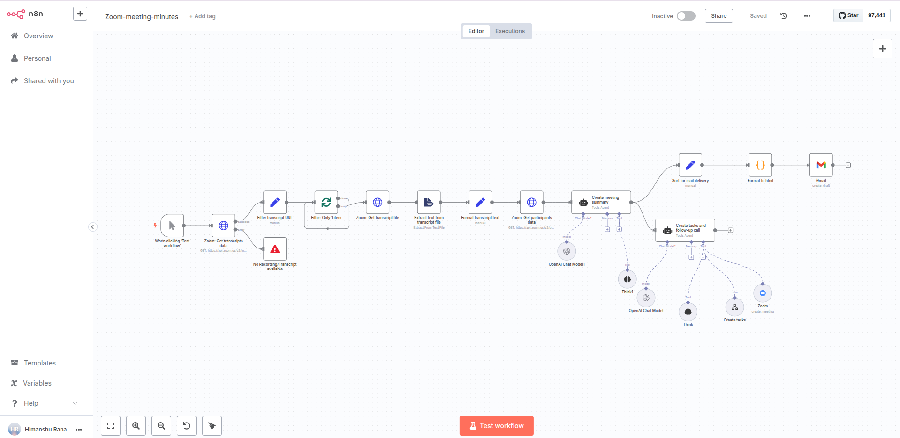

# Zoom Meeting Processing Workflow

Automatically processes Zoom meeting recordings to generate meeting summaries, create tasks, and send formatted email reports.

## Components

* Manual Trigger
* Zoom API - Get transcripts data
* Zoom API - Get transcript file
* Zoom API - Get participants data
* Extract text from transcript file
* Format transcript text
* OpenAI Chat Model (GPT-4o-mini)
* Create meeting summary agent
* Create tasks and follow-up call agent
* ClickUp task creation tool
* Zoom scheduling tool
* Gmail draft creation
* HTML formatter
* Error handling nodes

## Tools

* Zoom OAuth2 API
* OpenAI API
* Gmail OAuth2
* ClickUp integration
* LangChain agents
* File extraction utilities

## Examples

* **Weekly team standup**: Automatically extract action items and create ClickUp tasks for each team member
* **Client consultation**: Generate professional meeting minutes and email summary to client within minutes
* **Project planning session**: Identify deliverables, deadlines, and schedule follow-up meetings automatically
* **Training session**: Create formatted documentation and distribute to all participants via Gmail

## Technical Details

The workflow retrieves Zoom meeting recordings and transcripts, processes the text using AI agents to identify key information, creates structured meeting minutes, generates actionable tasks in ClickUp, schedules follow-up meetings, and delivers formatted HTML email summaries to participants. Error handling ensures graceful failure when recordings or transcripts are unavailable.